<p align="center">
  
</p>

<p align="center"><em>Instant on-the-fly harness assembler for Claude Code, Hermes, and OpenClaw.</em></p>

**Popcorn Harness** is a cross-platform plugin that discovers your available skills, agents, and commands on the fly, then pops them together into an optimized execution harness. No manual selection. No guessing. Just describe your task and let it assemble the right capabilities for you.

```
User: /popcorn-harness Prep this Next.js app for production

🍿 Popping harness!

Platform detected: Claude Code (project)
Tier: 3 — Full Pop

Assembled harness:
  Phase 1 (parallel): security-review + e2e-testing + seo
  Phase 2 (sequential): deployment-patterns → docker-patterns

Proceed? [y/n/adjust]
```

---

## How It Works

1. **Detects platform** — Claude Code, Hermes, or OpenClaw
2. **Discovers capabilities** — skills, agents, and commands available in your environment
3. **Applies progressive disclosure** based on task complexity:
   - **Quick Pop** — 1 capability, executes immediately
   - **Standard Pop** — 2-3 capabilities, shows plan, confirms
   - **Full Pop** — 4-5 capabilities or ambiguous task, full confirmation flow
4. **Assembles execution graph** — parallel phases where possible, sequential where required
5. **Executes and synthesizes** — structured output with key findings and action items

---

## Platform Support

| Platform | How capabilities are discovered |
|----------|--------------------------------|
| Claude Code | `claude agents` + skill dirs + command dirs |
| Hermes | `available_skills` injected in system prompt |
| OpenClaw | `available_skills` injected in system prompt |

---

## Installation

### Claude Code — via Plugin System (recommended)

Install directly from GitHub using the Claude Code plugin command:

```
/plugin install seilk/popcorn-harness
```

Or use the full URL form:

```
/plugin install https://github.com/seilk/popcorn-harness
```

After installation, run `/reload-plugins` if the commands don't appear immediately.
Skills are namespaced: use `/popcorn-harness:popcorn` or just trigger via the `popcorn` keyword.

### Claude Code — via Official Marketplace

popcorn-harness is listed in the Claude plugin directory. You can browse and install it from:

- **Claude.ai:** Settings → Extensions → browse "popcorn-harness"
- **Claude Code CLI:** `/plugin marketplace list` then `/plugin install popcorn-harness@claude-plugins-official`

### Claude Code — local development / testing

To test a local copy without installing:

```bash
claude --plugin-dir ./popcorn-harness
```

Use `/reload-plugins` after making changes. When the local `--plugin-dir` name matches an installed plugin, the local copy takes precedence for that session.

### Claude Code — manual install (fallback)

```bash
git clone https://github.com/seilk/popcorn-harness ~/.claude/plugins/popcorn-harness
```

### Hermes

```bash
cp -r skills/popcorn-harness ~/.hermes/skills/
```

The skill will appear in `available_skills` on the next session.

### OpenClaw

Add the skills directory to `external_dirs` in your Hermes config:

```yaml
# ~/.hermes/config.yaml
skills:
  external_dirs:
    - /path/to/popcorn-harness/skills
```

### Team / Custom Marketplace

If you host your own Claude Code marketplace, add popcorn-harness as a source:

```json
{
  "name": "my-marketplace",
  "plugins": [
    {
      "name": "popcorn-harness",
      "source": "https://github.com/seilk/popcorn-harness"
    }
  ]
}
```

Or point teammates directly at this repo as a marketplace:

```
/plugin marketplace add seilk/popcorn-harness
/plugin install popcorn-harness@popcorn-harness
```

---

## Usage

### Claude Code

```
/popcorn <task description>
```

Or invoke the orchestrator agent directly from any Claude Code session:

```
Use popcorn-orchestrator to: <task description>
```

### Hermes

```
popcorn — <task description>
```

Or just describe your task and say "use available skills":

```
use your available skills to review my codebase before deployment
```

### OpenClaw

Same as Hermes — the skill is automatically available once installed.

---

## Examples

**Single-domain task (Tier 1 — Quick Pop):**
```
popcorn — run a security review on this repo
→ Pops: security-review (1 capability, executes immediately)
```

**Multi-domain task (Tier 2 — Standard Pop):**
```
popcorn — audit my portfolio and suggest rebalancing
→ Pops: obsidian-finance-vault + tossctl + market-research
→ Shows plan, waits for confirmation
```

**Complex task (Tier 3 — Full Pop):**
```
popcorn — get this app production-ready
→ Pops: security-review + e2e-testing + seo + deployment-patterns + docker-patterns
→ Shows full discovery, proposes phased execution, requires explicit confirmation
```

---

## Design Principles

- **Progressive disclosure** — reveal complexity only when needed
- **Evidence-based selection** — capabilities chosen by description match, not name alone
- **Platform-agnostic** — same skill file works on Claude Code, Hermes, and OpenClaw
- **Budget-bounded** — hard cap of 5 capabilities per harness run to preserve quality
- **Fail-transparent** — missing capabilities are reported, not silently skipped

---

## Compatibility

| Component | Minimum version |
|-----------|----------------|
| Claude Code | Latest (claude CLI with agent support) |
| Hermes | Any version with `available_skills` injection |
| OpenClaw | Any version with `external_dirs` support |
| ECC (optional) | Any version — enhances discovery if installed |

---

## Troubleshooting

**"No capabilities found"**
- Claude Code: run `claude agents` manually to verify agent discovery works
- Hermes: check `skills.external_dirs` in `~/.hermes/config.yaml`
- OpenClaw: verify the skills path is correctly set in config

**"Platform detected incorrectly"**
- Set `OPENCLAW=1` environment variable to force OpenClaw detection
- Ensure `claude` CLI is in PATH for Claude Code detection

**"Harness produced poor results"**
- Try Tier 3: describe the task more broadly to trigger full discovery
- Manually specify capabilities: "popcorn — use security-review and e2e-testing to..."

---

## Registering with the Official Plugin Directory

The Claude plugin directory is surfaced as the `claude-plugins-official` marketplace inside Claude Code and is automatically available to all users. Listing there means anyone can install with a single `/plugin install` command.

### Step 1 — Pre-submission checklist

Before submitting, verify the following locally:

```bash
# 1. plugin.json exists and parses cleanly
cat .claude-plugin/plugin.json | python3 -m json.tool

# 2. All declared directories actually exist (skills/, agents/, commands/ etc.)
ls -1

# 3. Test the plugin loads without errors
claude --plugin-dir . --print "/help" 2>&1 | head -20
```

Mandatory fields in `.claude-plugin/plugin.json`:

| Field | Requirement |
|-------|-------------|
| `name` | kebab-case, unique, becomes the skill namespace |
| `description` | clear one-liner shown in marketplace listings |
| `version` | semver (e.g. `1.0.0`) |
| `license` | declared (e.g. `MIT`) |

Optional but strongly recommended for discoverability: `keywords`, `tags`, `homepage`, `repository`.

### Step 2 — Submit to the directory

Use one of the official in-app submission forms:

- **Claude.ai:** https://claude.ai/settings/plugins/submit
- **Console:** https://platform.claude.com/plugins/submit

You can submit either:
- A **GitHub URL** pointing to the repo root (e.g. `https://github.com/seilk/popcorn-harness`)
- A **zip file** of the plugin directory (preserving folder structure)

### Step 3 — Review process

Anthropic runs automated safety and quality checks on every submission. The review typically completes within a few days. During that time, users can still install directly via GitHub URL — marketplace listing adds discoverability, not functionality:

```
/plugin install https://github.com/seilk/popcorn-harness
```

### Step 4 — After approval

Once listed, users can find and install via the official marketplace:

```
/plugin install popcorn-harness@claude-plugins-official
```

The plugin also appears in the Extensions browser at Claude.ai → Settings → Extensions.

### Step 5 — Updates and re-submission

Every update requires re-submission — each version is scanned independently before going live.

Recommended workflow for releases:
1. Bump `version` in `.claude-plugin/plugin.json` (semver)
2. Commit and push to GitHub
3. Re-submit the same GitHub URL via the form above

### Anthropic Verified badge

Plugins with the Verified badge have passed additional manual review. There is no separate application process — Anthropic selects plugins internally. Improving your chances:
- Bundle related capabilities (skills + agents + commands) into a cohesive workflow
- Keep MCP connectors to well-known, auditable sources
- Maintain a clear README with usage examples and a troubleshooting section

---

## Contributing

Inspired by and built on patterns from:
- [ECC (Everything Claude Code)](https://github.com/anthropics/everything-claude-code) — `team-builder`, `agent-sort`, `agent-harness-construction`
- [Superpowers plugin](https://github.com/anthropics/claude-plugins-official) — `brainstorming`, `writing-plans`

PRs welcome. Please include examples for any new platform support.

---

## License

MIT
